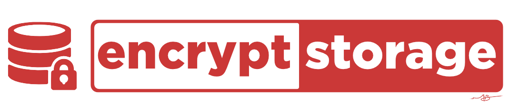

<a href="https://github.com/michelonsouza/encrypt-storage#readme">
  
</a>

[](https://github.com/michelonsouza/encrypt-storage)  [](https://github.com/sponsors/michelonsouza) [](https://github.com/michelonsouza/encrypt-storage/blob/main/LICENSE)

[](https://github.com/michelonsouza/encrypt-storage/blob/main/package.json#L3) [](https://www.npmjs.com/package/encrypt-storage) [](https://www.jsdelivr.com/package/npm/encrypt-storage)

  [](https://github.com/michelonsouza/encrypt-storage)

[](https://codecov.io/github/michelonsouza/encrypt-storage) [](https://github.com/michelonsouza/encrypt-storage/actions/workflows/code-quality-verify.yml) [](https://github.com/michelonsouza/encrypt-storage/actions/workflows/ci.yml) [](https://github.com/michelonsouza/encrypt-storage/actions/workflows/ci.yml)

# Encrypt Storage

`encrypt-storage` wraps the browser Storage API with transparent encryption. Store objects, strings, or any serializable value in `localStorage`, `sessionStorage`, or browser cookies while keeping the same familiar Storage-like API.

Choose between a **fully synchronous** implementation powered by **@noble/ciphers** or the native **Web Crypto API**, select an AES algorithm, and keep your application compatible with modern browsers and frameworks.

> [!NOTE]
> ## 🎉 Welcome to Encrypt Storage v3
>
> Version 3 is the most significant release in the project's history.
>
> This release is a complete modernization of the library, focused on modernization, performance, security, and compatibility with today's JavaScript ecosystem.
>
> ### What's new?
>
> - ⚡ Replaced **CryptoJS** with modern cryptography powered by **Web Crypto API** and **Noble Ciphers/Hashes**
> - 🌐 Full support for modern runtimes including **Browsers, Node.js, Bun, Deno, Next.js, Astro, Vite, Nuxt**, and more
> - ⏳ **New built-in TTL (Time-To-Live) API** featuring dedicated methods such as `setTTL`, `getTTL`, `hasTTL`, `refreshTTL`, `removeTTL`, and more for managing expiring data
> - 🔒 Stronger key derivation using **PBKDF2**
> - 🚀 Smaller bundle size and improved tree-shaking
> - 🧠 Lazy initialization for better SSR compatibility
> - 📦 Modern ESM-first distribution with full TypeScript support
> - 🧪 Rewritten test suite and improved code quality
> - 🛠️ Modernized build pipeline, tooling, and CI
>
> While this is a major release internally, the public API remains familiar, making migration from v2 straightforward for most projects.
>
> Thank you to everyone who has supported Encrypt Storage over the years. ❤️

> [!IMPORTANT]
> **Browser-side encryption is not a substitute for server-side security.**
>
> Secrets shipped to the client can always be extracted by a sufficiently motivated attacker. Encrypt Storage protects data **at rest** inside browser storage and helps prevent casual inspection, but it must not be considered a replacement for authentication, authorization, or server-side secret management.

## Features

- 🔒 Encrypt values stored in `localStorage`, `sessionStorage`, and browser cookies.
- ⚡ Choose between synchronous (`@noble/ciphers`) and asynchronous (native Web Crypto API) encryption engines.
- ⏳ Built-in TTL (Time-To-Live) support.
- 🧩 Familiar Storage-like API with bulk operations, pattern matching, and utility methods.
- 📦 Automatic serialization/deserialization.
- 🏷️ Prefix namespaces.
- 🗂️ Compatible with Redux Persist, Vuex Persist, Pinia Persist and other Storage-based integrations.

## Table of contents

- [Encrypt Storage](#encrypt-storage)
  - [Features](#features)
  - [Table of contents](#table-of-contents)
  - [Built with](#built-with)
  - [Installation](#installation)
    - [Using a CDN](#using-a-cdn)
      - [unpkg](#unpkg)
      - [jsDelivr](#jsdelivr)
  - [Version and runtime support](#version-and-runtime-support)
  - [Migration to version 3](#migration-to-version-3)
  - [Choose an encryption engine](#choose-an-encryption-engine)
  - [Usage](#usage)
    - [Noble (synchronous)](#noble-synchronous)
    - [Web Crypto API (asynchronous)](#web-crypto-api-asynchronous)
    - [AsyncEncryptStorage (fully promise-based)](#asyncencryptstorage-fully-promise-based)
    - [Multiple instances](#multiple-instances)
    - [Server-side rendering](#server-side-rendering)
      - [Next.js Client Components](#nextjs-client-components)
      - [getStorage alternative](#getstorage-alternative)
  - [Options](#options)
    - [Validation](#validation)
  - [Storage methods](#storage-methods)
    - [Write and read values](#write-and-read-values)
    - [Bulk operations](#bulk-operations)
    - [Pattern operations](#pattern-operations)
    - [Storage utilities](#storage-utilities)
    - [Encrypt, decrypt, and hash](#encrypt-decrypt-and-hash)
  - [Cookies](#cookies)
    - [Noble cookies (synchronous)](#noble-cookies-synchronous)
    - [Web Crypto cookies (asynchronous)](#web-crypto-cookies-asynchronous)
    - [Cookie API reference](#cookie-api-reference)
  - [TTL (Time-To-Live)](#ttl-time-to-live)
    - [Store a value with TTL](#store-a-value-with-ttl)
    - [Read a TTL value](#read-a-ttl-value)
    - [Check TTL state](#check-ttl-state)
    - [TTL metadata and remaining time](#ttl-metadata-and-remaining-time)
    - [Refresh and remove TTL](#refresh-and-remove-ttl)
    - [TTL with Web Crypto (asynchronous)](#ttl-with-web-crypto-asynchronous)
  - [State management persisters](#state-management-persisters)
    - [Vuex Persist](#vuex-persist)
    - [Zustand Persist](#zustand-persist)
    - [Redux Persist](#redux-persist)
    - [Pinia persist plugins](#pinia-persist-plugins)
  - [Notifications](#notifications)
  - [Error handling](#error-handling)
    - [InvalidSecretKeyError](#invalidsecretkeyerror)
    - [IsNotBrowserEnvironmentError](#isnotbrowserenvironmenterror)
    - [NullValueError](#nullvalueerror)
    - [UndefinedValueError](#undefinedvalueerror)
  - [License](#license)
  - [Help project](#help-project)

## Built with

| Category | Technology |
| --- | --- |
| Language | [TypeScript](https://www.typescriptlang.org/) |
| Encryption (sync) | [@noble/ciphers](https://github.com/paulmillr/noble-ciphers) — AES-GCM, AES-CBC, AES-CTR |
| Hashing | [@noble/hashes](https://github.com/paulmillr/noble-hashes) — SHA-256, PBKDF2 |
| Encryption (async) | [Web Crypto API](https://developer.mozilla.org/en-US/docs/Web/API/Web_Crypto_API) — AES-GCM, AES-CBC, AES-CTR |
| Bundler | [Vite+](https://viteplus.dev/) (Vite + Rolldown + tsdown) |
| Test runner | [Vitest](https://vitest.dev/) |
| Coverage | [v8](https://v8.dev/blog/javascript-code-coverage) via `@vitest/coverage-v8` |
| Linter | [Oxlint](https://oxc.rs/) |
| Formatter | [Oxfmt](https://oxc.rs/) |
| Package manager | [pnpm](https://pnpm.io/) |
| Git hooks | [Vite+ staged hooks](https://viteplus.dev/) + [commitlint](https://commitlint.js.org/) |
| CI | [GitHub Actions](https://github.com/features/actions) |

## Installation

```bash
npm install encrypt-storage
```

```bash
yarn add encrypt-storage
```

```bash
pnpm add encrypt-storage
```

The package is intended for bundlers and supports ESM and CommonJS imports. Requires Node.js `>=20`.

### Using a CDN

For browser-only projects, load the ESM build from a CDN. Version 3 uses the factory API, so create an instance with `EncryptStorage.create()`.

#### unpkg

```html
<script type="module">
  import { EncryptStorage } from 'https://unpkg.com/encrypt-storage@latest?module';

  const encryptStorage = EncryptStorage.create('secret-key-value', {
    engine: 'noble',
    prefix: '@app',
  });

  encryptStorage.setItem('user', { name: 'Ada Lovelace' });
</script>
```

#### jsDelivr

```html
<script type="module">
  import { EncryptStorage } from 'https://cdn.jsdelivr.net/npm/encrypt-storage@latest/+esm';

  const encryptStorage = EncryptStorage.create('secret-key-value', {
    engine: 'noble',
    prefix: '@app',
  });

  encryptStorage.setItem('user', { name: 'Ada Lovelace' });
</script>
```

For production, pin the package to a specific version instead of using `@latest`.

## Version and runtime support

| Encrypt Storage version | Status | Documentation |
| --- | --- | --- |
| `3.x` | Current API. Requires explicit engine<br /> selection with `EncryptStorage.create()`. | This README |
| `2.16.x` | Legacy API. | [Version 2 documentation](./docs/README_V2.md) |
| `1.3.10` `(deprecated)` | Legacy API. | [Version 1 documentation](./docs/README_V1.md) |

| Runtime or framework | Support |
| --- | --- |
| Modern browsers | Supported when `localStorage` or `sessionStorage` is available. |
| `noble` engine | Synchronous encryption via `@noble/ciphers`. Works with the browser Storage API. |
| `web-crypto` engine | Requires `globalThis.crypto.subtle`, available in modern browser secure contexts. |
| Node.js | Requires `>=20`. Needed for the native `crypto` module used by `@noble/ciphers` and development tooling. |
| Next.js App Router | Supported in Client Components with `'use client'` (Next.js `13+`). |
| Next.js Pages Router and SSR | Supported when the storage instance is created or used only in the browser. |

## Migration to version 3

Version 3 has a breaking change: instances are now created with `EncryptStorage.create()` and an explicit `engine`. Do not instantiate `EncryptStorage` with `new`.

| Before version 3 | Version 3 |
| --- | --- |
| `new EncryptStorage(secretKey, options)` | `EncryptStorage.create(secretKey, { engine: 'noble', ...options })` |
| One implicit encryption implementation | Explicit `noble` or `web-crypto` engine |
| Synchronous API | `noble` is synchronous; `web-crypto` encrypt/decrypt operations return promises, while removal and storage utility methods remain synchronous. |

The same secret key and compatible algorithm are required to decrypt existing values. Encrypted payloads produced by different engines are not interchangeable; plan a migration if switching engines.

> **⚠️ Engine compatibility**: The `noble` (synchronous) and `web-crypto` (asynchronous) engines use different PBKDF2 key derivation parameters, optimized for each mode's performance and user experience. Data encrypted with one engine cannot be decrypted by the other. Choose an engine once per storage namespace and keep it consistent.

## Choose an encryption engine

| Engine | Default algorithm | API style | Use it when |
| --- | --- | --- | --- |
| `noble` | `AES-GCM` | Synchronous | You need a native `Storage`-compatible shape, especially for persisters. |
| `web-crypto` | `AES-GCM` | Mixed | You want the browser's native Web Crypto API and can `await` encrypted operations. |
| `AsyncEncryptStorage` | Selected engine | Fully promise-based | Your application requires promises for every exposed method, such as an asynchronous integration layer. |

All instances require a `secretKey` with at least 10 characters. Keep it stable: changing it makes existing encrypted values unreadable.

Supported algorithms for both engines: `AES-GCM`, `AES-CBC`, and `AES-CTR`. `AES-GCM` is the default.

## Usage

Create and export one instance per storage namespace. A singleton module keeps the configuration consistent across an application.

### Noble (synchronous)

Use `noble` for regular synchronous browser storage operations.

```ts
import { EncryptStorage } from 'encrypt-storage';

export const encryptStorage = EncryptStorage.create('secret-key-value', {
  engine: 'noble',
  prefix: '@app',
  storageType: 'localStorage',
});

encryptStorage.setItem('user', { id: '42', name: 'Ada Lovelace' });

const user = encryptStorage.getItem<{ id: string; name: string }>('user');
```

| Browser storage key | Stored value | `getItem('user')` result |
| --- | --- | --- |
| `@app:user` | Encrypted text | `{ id: '42', name: 'Ada Lovelace' }` |

### Web Crypto API (asynchronous)

Use the native Web Crypto API with `engine: 'web-crypto'`. Operations that encrypt or decrypt values must be awaited. It is available only where `globalThis.crypto.subtle` is supported.

```ts
import { EncryptStorage } from 'encrypt-storage';

export const encryptStorage = EncryptStorage.create('secret-key-value', {
  engine: 'web-crypto',
  encAlgorithm: 'AES-GCM',
  prefix: '@app',
  storageType: 'sessionStorage',
});

await encryptStorage.setItem('access-token', 'token-value');
const token = await encryptStorage.getItem<string>('access-token');
```

| Browser storage key | Stored value | `await getItem()` result |
| --- | --- | --- |
| `@app:access-token` | Encrypted text with a random IV | `'token-value'` |

Supported algorithms are `AES-GCM`, `AES-CBC`, and `AES-CTR`. `AES-GCM` is the default.

`web-crypto` intentionally has a mixed API because the browser Storage operations themselves are synchronous.

| Asynchronous (`Promise`) | Synchronous |
| --- | --- |
| `setItem`, `setMultipleItems`, `getItem`, `getMultipleItems`, `getItemFromPattern` | `removeItem`, `removeMultipleItems`, `removeItemFromPattern`, `clear`, `key`, `length` |
| `encryptValue`, `decryptValue`, `hash`, `cookie.set`, `cookie.get`, `cookie.remove` | — |

```ts
await encryptStorage.setItem('access-token', 'token-value');
encryptStorage.removeItem('access-token');
encryptStorage.clear();
```

### AsyncEncryptStorage (fully promise-based)

`AsyncEncryptStorage` wraps the selected engine and exposes a promise-returning API for every method it provides. It is useful when an application expects asynchronous storage calls, including integrations built around promise-based runtimes such as React Native.

```ts
import { AsyncEncryptStorage } from 'encrypt-storage';

export const encryptStorage = new AsyncEncryptStorage('secret-key-value', {
  engine: 'web-crypto',
  encAlgorithm: 'AES-GCM',
  prefix: '@app',
});

await encryptStorage.setItem('user', { id: '42', name: 'Ada Lovelace' });
const user = await encryptStorage.getItem<{ id: string; name: string }>('user');

await encryptStorage.removeItem('user');
await encryptStorage.clear();
```

| Method | Return type |
| --- | --- |
| `length` | `Promise<number>` |
| `setItem`, `removeItem`, `removeItemFromPattern`, `clear` | `Promise<void>` |
| `getItem`, `getItemFromPattern`, `key` | `Promise<value>` |
| `encryptValue`, `decryptValue`, `hash` | `Promise<value>` |

`AsyncEncryptStorage` exposes `setItem`, `getItem`, `removeItem`, `getItemFromPattern`, `removeItemFromPattern`, `clear`, `key`, `encryptValue`, `decryptValue`, `hash`, and `length`. For bulk operations and cookies, use the engine instance returned by `EncryptStorage.create()`.

> **React Native note**: this package requires a compatible Web Storage implementation (`localStorage` or `sessionStorage`) to persist data. `AsyncEncryptStorage` provides a promise-based API, but it does not include a React Native storage backend or replace `@react-native-async-storage/async-storage`.

### Multiple instances

Pass a unique `prefix` to every instance that shares the same browser storage. This prevents keys from colliding.

```ts
const authStorage = EncryptStorage.create('secret-key-value', {
  engine: 'noble',
  prefix: '@auth',
});

const settingsStorage = EncryptStorage.create('secret-key-value', {
  engine: 'noble',
  prefix: '@settings',
});

authStorage.setItem('token', 'token-value');
settingsStorage.setItem('theme', 'dark');
```

| Key | Value |
| --- | --- |
| `@auth:token` | Encrypted text |
| `@settings:theme` | Encrypted text |

### Server-side rendering

Browser storage is unavailable during server-side rendering. Create or use the instance only on the client.

#### Next.js Client Components

For Next.js App Router, put `'use client'` at the top of the component that uses browser storage. This marks the component as client-side, allowing access to `localStorage`, `sessionStorage`, and `EncryptStorage` methods.

```tsx
'use client';

import { useEffect, useState } from 'react';
import { EncryptStorage } from 'encrypt-storage';

const encryptStorage = EncryptStorage.create('secret-key-value', {
  engine: 'noble',
  prefix: '@app',
});

export function UserName() {
  const [name, setName] = useState<string | undefined>();

  useEffect(() => {
    setName(encryptStorage.getItem<string>('user-name'));
  }, []);

  return <p>{name ?? 'Anonymous'}</p>;
}
```

Do not import this Client Component into a Server Component when the storage instance is created at module scope. Keep the browser-storage code inside a file marked with `'use client'`.

#### getStorage alternative

For shared modules, the Pages Router, or situations where a client-only component is not appropriate, keep the `getStorage()` guard. It returns `null` during SSR and an instance in the browser.

```ts
import { EncryptStorage } from 'encrypt-storage';

export const getStorage = () => {
  if (typeof window === 'undefined') return null;

  return EncryptStorage.create('secret-key-value', {
    engine: 'noble',
    prefix: '@app',
  });
};
```

For client-side framework variables, use the framework's public environment-variable convention. Do not expose a server-only secret in browser code.

## Options

Pass an options object as the second argument to `EncryptStorage.create()`.

| Property | Default | Applies to | Description |
| --- | --- | --- | --- |
| `engine` | — | all | **Required.** `'noble'` or `'web-crypto'`. |
| `prefix` | `''` | all | Prefix added to every storage key as `prefix:key`. |
| `storageType` | `'localStorage'` | all | Browser storage target: `'localStorage'` or `'sessionStorage'`. |
| `stateManagementUse` | `false` | all | Returns raw strings without automatic parsing; required by persisters. Use only with `noble` for persisters. |
| `doNotEncryptValues` | `false` | all | Stores values without encryption. Prefixes and storage helpers still apply. |
| `doNotParseValues` | `false` | all | Disables automatic `JSON.stringify`/`JSON.parse` conversion. |
| `notifyHandler` | `undefined` | all | Callback invoked after supported storage operations. |
| `validation` | `undefined` | all | Value validation rules applied on `setItem`. See [Validation](#validation). |
| `encAlgorithm` | `'AES-GCM'` | all | Encryption algorithm. Applies to both engines. |

Supported algorithms: `AES-GCM`, `AES-CBC`, and `AES-CTR`.

`doNotParseValues` expects string-compatible values. With its default `false`, objects are serialized on write and parsed on read; scalar values are recovered when valid JSON.

### Validation

Pass a `validation` object to enforce value constraints on every `setItem` call. When a validation rule is violated, an error is thrown synchronously, preventing the value from being written to storage.

```ts
const encryptStorage = EncryptStorage.create('secret-key-value', {
  engine: 'noble',
  prefix: '@app',
  validation: {
    allowNull: false,
    allowUndefined: false,
  },
});

// Throws NullValueError
encryptStorage.setItem('key', null);

// Throws UndefinedValueError
encryptStorage.setItem('key', undefined);
```

| Property | Default | Description |
| --- | --- | --- |
| `allowNull` | `true` | When `false`, storing `null` throws `NullValueError`. |
| `allowUndefined` | `false` | When `false`, storing `undefined` throws `UndefinedValueError`. |
| `strict` | `false` | When `true`, overrides both `allowNull` and `allowUndefined` to `false`. Neither `null` nor `undefined` can be stored. |

The `strict` option is a shorthand. It takes precedence over individual settings:

```ts
const encryptStorage = EncryptStorage.create('secret-key-value', {
  engine: 'noble',
  validation: { strict: true },
});

// Both throw — strict disallows null and undefined regardless of other settings
encryptStorage.setItem('key', null);      // NullValueError
encryptStorage.setItem('key', undefined); // UndefinedValueError
```

By default (no `validation` option), `null` is allowed and `undefined` is not. This matches standard JSON serialization behavior where `null` is a valid JSON value but `undefined` is not.

Validation applies to `setItem` and, by extension, to any method that calls it internally (`setMultipleItems`, `setTTL`).

## Storage methods

The examples below use a synchronous noble instance. Prefixes are added to physical browser-storage keys but are omitted from method parameters and returned pattern keys.

| Method | Parameters | Return (`noble`) | Return (`web-crypto`) |
| --- | --- | --- | --- |
| `setItem` | `(key: string, value: any, doNotEncrypt?: boolean)` | `void` | `Promise<void>` |
| `getItem<T>` | `(key: string, doNotDecrypt?: boolean)` | `T \| undefined` | `Promise<T \| undefined>` |
| `removeItem` | `(key: string)` | `void` | `void` |
| `setMultipleItems` | `(items: [string, any][], doNotEncrypt?: boolean)` | `void` | `Promise<void>` |
| `getMultipleItems` | `(keys: string[], doNotDecrypt?: boolean)` | `Record<string, any>` | `Promise<Record<string, any>>` |
| `removeMultipleItems` | `(keys: string[])` | `void` | `void` |
| `getItemFromPattern` | `(pattern: string, options?: GetFromPatternOptions)` | `Record<string, any> \| undefined` | `Promise<Record<string, any> \| undefined>` |
| `removeItemFromPattern` | `(pattern: string, options?: RemoveFromPatternOptions)` | `void` | `void` |
| `clear` | `()` | `void` | `void` |
| `key` | `(index: number)` | `string \| null` | `string \| null` |
| `length` | — (getter) | `number` | `number` |
| `encryptValue` | `(value: any)` | `string` | `Promise<string>` |
| `decryptValue<T>` | `(value: string)` | `T \| null` | `Promise<T \| null>` |
| `hash` | `(value: string)` | `string` | `Promise<string>` |

```ts
const encryptStorage = EncryptStorage.create('secret-key-value', {
  engine: 'noble',
  prefix: '@example',
});
```

With a Web Crypto instance, add `await` to `setItem`, `setMultipleItems`, `getItem`, `getMultipleItems`, `getItemFromPattern`, `encryptValue`, `decryptValue`, and `hash`. Keep `removeItem`, `removeMultipleItems`, `removeItemFromPattern`, `clear`, `key`, and `length` synchronous.

### Write and read values

```ts
encryptStorage.setItem('token', 'edbe38e0-748a-49c8-9f8f-b68f38dbe5a2');
encryptStorage.setItem('user', { id: '123456', name: 'John Doe' });

const token = encryptStorage.getItem<string>('token');
const user = encryptStorage.getItem<{ id: string; name: string }>('user');
```

| Key | Value in browser storage | Read result |
| --- | --- | --- |
| `@example:token` | Encrypted text | `'edbe38e0-748a-49c8-9f8f-b68f38dbe5a2'` |
| `@example:user` | Encrypted text | `{ id: '123456', name: 'John Doe' }` |

Pass `true` as the third argument to `setItem` to skip encryption for that call. Pass `true` as the second argument to `getItem` to skip decryption for that call.

### Bulk operations

```ts
encryptStorage.setMultipleItems([
  ['token', 'token-value'],
  ['user', { id: '123456', name: 'John Doe' }],
]);

const values = encryptStorage.getMultipleItems(['token', 'user', 'missing']);
encryptStorage.removeMultipleItems(['token', 'user']);
```

| Method | Result |
| --- | --- |
| `getMultipleItems(['token', 'user', 'missing'])` | `{ token: 'token-value', user: { id: '123456', name: 'John Doe' }, missing: undefined }` |
| `removeMultipleItems(['token', 'user'])` | Removes both prefixed browser-storage keys. |

### Pattern operations

`getItemFromPattern()` and `removeItemFromPattern()` look for matching storage keys within the current prefix. Set `exact: true` to require an exact key match. `getItemFromPattern()` returns all matches by default; set `multiple: false` to return one value.

```ts
encryptStorage.setItem('fruit:apple', 'apple');
encryptStorage.setItem('fruit:grape', 'grape');
encryptStorage.setItem('vegetable:lettuce', 'lettuce');

const fruit = encryptStorage.getItemFromPattern('fruit');
encryptStorage.removeItemFromPattern('vegetable');
```

| Key before removal | Value |
| --- | --- |
| `@example:fruit:apple` | Encrypted text for `'apple'` |
| `@example:fruit:grape` | Encrypted text for `'grape'` |
| `@example:vegetable:lettuce` | Encrypted text for `'lettuce'` |

```ts
// { 'fruit:apple': 'apple', 'fruit:grape': 'grape' }
console.log(fruit);
```

### Storage utilities

```ts
const firstKey = encryptStorage.key(0);
const itemCount = encryptStorage.length;

encryptStorage.removeItem('token');
encryptStorage.clear();
```

| Member | Result |
| --- | --- |
| `key(index)` | Browser-storage key at `index`, or `null`. |
| `length` | Number of entries in the selected underlying browser storage. |
| `removeItem(key)` | Removes the prefixed key. |
| `clear()` | Clears **all entries** in the selected underlying storage, not only the current prefix. |

### Encrypt, decrypt, and hash

Use these helpers when encryption is needed without writing to browser storage.

```ts
const encrypted = encryptStorage.encryptValue({ id: '123456', name: 'John Doe' });
const decrypted = encryptStorage.decryptValue<{ id: string; name: string }>(encrypted);
const digest = encryptStorage.hash('John Doe');
```

| Method | Result |
| --- | --- |
| `encryptValue(value)` | An encrypted string. |
| `decryptValue<T>(value)` | The decrypted value, parsed when possible. |
| `hash(value)` | SHA-256 hash string. |

## Cookies

Every storage instance exposes `cookie.set`, `cookie.get`, and `cookie.remove`. Cookie operations use the same selected encryption engine. With the `noble` engine all cookie methods are synchronous; with `web-crypto` all three methods return promises.

### Noble cookies (synchronous)

```ts
const encryptStorage = EncryptStorage.create('secret-key-value', {
  engine: 'noble',
  prefix: '@app',
});

encryptStorage.cookie.set(
  'preferences',
  { colorScheme: 'dark' },
  {
    path: '/',
    expires: new Date(Date.now() + 86_400_000),
    secure: true,
    sameSite: 'lax',
  },
);

const preferences = encryptStorage.cookie.get<{ colorScheme: string }>('preferences');
encryptStorage.cookie.remove('preferences', { path: '/' });
```

### Web Crypto cookies (asynchronous)

With `engine: 'web-crypto'`, **all** cookie methods (`set`, `get`, and `remove`) are asynchronous and must be awaited.

```ts
const encryptStorage = EncryptStorage.create('secret-key-value', {
  engine: 'web-crypto',
  prefix: '@app',
});

await encryptStorage.cookie.set(
  'preferences',
  { colorScheme: 'dark' },
  {
    path: '/',
    expires: new Date(Date.now() + 86_400_000),
    secure: true,
    sameSite: 'lax',
  },
);

const preferences = await encryptStorage.cookie.get<{ colorScheme: string }>('preferences');
await encryptStorage.cookie.remove('preferences', { path: '/' });
```

### Cookie API reference

| Method | `noble` return | `web-crypto` return |
| --- | --- | --- |
| `cookie.set(key, value, options?)` | `void` | `Promise<void>` |
| `cookie.get<T>(key)` | `T \| null` | `Promise<T \| null>` |
| `cookie.remove(key, options?)` | `void` | `Promise<void>` |

| Option | Type | Description |
| --- | --- | --- |
| `expires` | `number \| Date` | Expiration: seconds from now (`number`) or absolute date (`Date`). |
| `path` | `string` | Cookie path. |
| `domain` | `string` | Cookie domain. |
| `secure` | `boolean` | Marks the cookie as secure. |
| `sameSite` | `'strict' \| 'lax' \| 'none'` | SameSite attribute. |

`cookie.remove` accepts `path` and `domain` options to match the original cookie scope.

Cookies set from JavaScript cannot be `HttpOnly`; use server-set `HttpOnly` cookies for session tokens whenever possible.

## TTL (Time-To-Live)


Every storage instance exposes a TTL API that stores values with an expiration time. When a TTL item expires, it is **lazily removed**: the item is deleted from browser storage only when it is accessed after expiration. There is no background observer, timer, or polling mechanism watching for expiration. This means an expired item remains physically in storage until your code reads it with `getTTL`, `hasTTL`, `hasExpired`, `getTTLMetadata`, `getRemainingTTL`, or `refreshTTL`.

> **Important**: expired items are cleaned up on access, not on a schedule. If your application never reads an expired key, it stays in browser storage indefinitely. Design your access patterns accordingly, or call `getTTL` for known keys at application startup.

The TTL API is available on both `noble` (synchronous) and `web-crypto` (asynchronous) engines. The examples below use the synchronous `noble` engine; see [TTL with Web Crypto](#ttl-with-web-crypto-asynchronous) for the async equivalent.

```ts
const encryptStorage = EncryptStorage.create('secret-key-value', {
  engine: 'noble',
  prefix: '@app',
});
```

### Store a value with TTL

Use `setTTL` to store a value that expires after a given duration or at a specific date.

```ts
// Expire in 3600 seconds (1 hour)
encryptStorage.setTTL({
  key: 'access_token',
  value: 'eyJhbGciOiJIUzI1NiIs...',
  ttl: 3600,
});

// Expire at a specific date
encryptStorage.setTTL({
  key: 'session',
  value: { userId: '42', role: 'admin' },
  ttl: new Date('2030-01-01T00:00:00Z'),
});

// Store without encryption
encryptStorage.setTTL({
  key: 'public_notice',
  value: 'Maintenance at 3 AM',
  ttl: 7200,
  doNotEncrypt: true,
});
```

| Parameter | Type | Description |
| --- | --- | --- |
| `key` | `string` | Storage key. |
| `value` | `T` | Value to store. Objects are serialized automatically. |
| `ttl` | `number \| Date` | Expiration: seconds from now (`number`) or absolute date (`Date`). |
| `doNotEncrypt` | `boolean` | Skip encryption for this item. Default `false`. |

The stored value in browser storage is an encrypted JSON object containing the original value and the expiration timestamp. The prefix is applied to the key as with regular `setItem`.

### Read a TTL value

Use `getTTL` to retrieve a stored value. If the item has expired, it is removed from storage and `null` is returned.

```ts
const token = encryptStorage.getTTL<string>('access_token');

if (token) {
  // Token is still valid
  api.setHeader('Authorization', `Bearer ${token}`);
} else {
  // Token expired or never existed — redirect to login
  router.push('/login');
}
```

```ts
const session = encryptStorage.getTTL<{ userId: string; role: string }>('session');
// session is typed as { userId: string; role: string } | null
```

| Scenario | Return value | Side effect |
| --- | --- | --- |
| Key exists and has not expired | `T` (the stored value) | None |
| Key exists and has expired | `null` | Item is removed from storage |
| Key does not exist | `null` | None |

### Check TTL state

```ts
// Returns true when the key exists and has NOT expired
const exists = encryptStorage.hasTTL('access_token');

// Returns true when the key does not exist or HAS expired
const expired = encryptStorage.hasExpired('access_token');
```

| Method | Returns `true` when | Removes expired item |
| --- | --- | --- |
| `hasTTL(key)` | Key exists and is still valid | Yes (if expired) |
| `hasExpired(key)` | Key does not exist or has expired | Yes (if expired) |

Both methods trigger lazy removal when the item is expired.

### TTL metadata and remaining time

```ts
const metadata = encryptStorage.getTTLMetadata('access_token');

if (metadata) {
  console.log(metadata.expiresAt);  // Date object
  console.log(metadata.remaining);  // Remaining time in milliseconds
  console.log(metadata.expired);    // false (always false when metadata is returned)
}

const remaining = encryptStorage.getRemainingTTL('access_token');

if (remaining !== null) {
  console.log(`Token expires in ${remaining} seconds`);
}
```

| Method | Return type | Description |
| --- | --- | --- |
| `getTTLMetadata(key)` | `TTLMetadata \| null` | Returns `expiresAt` (Date), `remaining` (ms), and `expired` (boolean). Returns `null` when the key does not exist or has expired. |
| `getRemainingTTL(key)` | `number \| null` | Remaining lifetime in seconds. Returns `null` when the key does not exist or has expired. |

### Refresh and remove TTL

```ts
// Extend the expiration by setting a new TTL (in seconds from now)
const refreshed = encryptStorage.refreshTTL({
  key: 'access_token',
  ttl: 1800,
});
// refreshed === true if the key existed, false otherwise

// Or set a new absolute expiration date
encryptStorage.refreshTTL({
  key: 'session',
  ttl: new Date('2030-06-01T00:00:00Z'),
});

// Remove the TTL, making the value permanent
const removed = encryptStorage.removeTTL('access_token');
// removed === true if the key existed, false otherwise
// The value is now stored permanently without TTL metadata
```

| Method | Return | Description |
| --- | --- | --- |
| `refreshTTL({ key, ttl })` | `boolean` | Updates the expiration time. The stored value remains unchanged. Returns `false` when the key does not exist or has expired. |
| `removeTTL(key)` | `boolean` | Removes the TTL wrapper. The plain value is re-stored as a permanent item. Returns `false` when the key does not exist or has expired. |

### TTL with Web Crypto (asynchronous)

With the `web-crypto` engine, all TTL methods return promises. The API is identical otherwise.

```ts
const encryptStorage = EncryptStorage.create('secret-key-value', {
  engine: 'web-crypto',
  prefix: '@app',
});

await encryptStorage.setTTL({
  key: 'access_token',
  value: 'eyJhbGciOiJIUzI1NiIs...',
  ttl: 3600,
});

const token = await encryptStorage.getTTL<string>('access_token');
const exists = await encryptStorage.hasTTL('access_token');
const expired = await encryptStorage.hasExpired('access_token');
const metadata = await encryptStorage.getTTLMetadata('access_token');
const remaining = await encryptStorage.getRemainingTTL('access_token');
const refreshed = await encryptStorage.refreshTTL({ key: 'access_token', ttl: 1800 });
const removed = await encryptStorage.removeTTL('access_token');
```

| Method | `noble` | `web-crypto` |
| --- | --- | --- |
| `setTTL` | `void` | `Promise<void>` |
| `getTTL` | `T \| null` | `Promise<T \| null>` |
| `hasTTL` | `boolean` | `Promise<boolean>` |
| `hasExpired` | `boolean` | `Promise<boolean>` |
| `getTTLMetadata` | `TTLMetadata \| null` | `Promise<TTLMetadata \| null>` |
| `getRemainingTTL` | `number \| null` | `Promise<number \| null>` |
| `refreshTTL` | `boolean` | `Promise<boolean>` |
| `removeTTL` | `boolean` | `Promise<boolean>` |

## State management persisters

State-management persisters must use the **`noble` engine**. They expect a synchronous, native `Storage`-like interface; the asynchronous `web-crypto` engine does not satisfy that contract. Set `stateManagementUse: true` so values are returned as raw strings, which is required for persisters to serialize and deserialize state correctly.

```ts
import { EncryptStorage } from 'encrypt-storage';

export const persisterStorage = EncryptStorage.create('secret-key-value', {
  engine: 'noble',
  stateManagementUse: true,
  prefix: '@app',
});
```

### Vuex Persist

```ts
import VuexPersistence from 'vuex-persist';
import { persisterStorage } from './storage';

const vuexLocal = new VuexPersistence<RootState>({
  storage: persisterStorage,
});
```

### Zustand Persist

Zustand's `persist` middleware accepts a custom `storage` via `createJSONStorage`. Wrap the synchronous `noble` instance to satisfy its interface. Do not use `web-crypto` directly unless you provide an async-compatible storage adapter.

```ts
import { createStore } from 'zustand/vanilla'
import { persist, createJSONStorage } from 'zustand/middleware';,

import { persisterStorage } from './storage';

type PositionStoreState = { position: { x: number; y: number } }

type PositionStoreActions = {
  setPosition: (nextPosition: PositionStoreState['position']) => void
}

type PositionStore = PositionStoreState & PositionStoreActions

const storage = createJSONStorage(() => ({
  getItem: (name) => persisterStorage.getItem(name) ?? null,
  setItem: (name, value) => persisterStorage.setItem(name, value),
  removeItem: (name) => persisterStorage.removeItem(name),
}));

const positionStore = createStore<PositionStore>()(
  persist(
    (set) => ({
      position: { x: 0, y: 0 },
      setPosition: (position) => set({ position }),
    }),
    {
      storage,
      name: 'position-store',
    }
  ),
);
```

### Redux Persist

Use the same synchronous `noble` instance. Do not use `web-crypto` or a custom asynchronous wrapper with this integration.

```ts
import { persistReducer } from 'redux-persist';
import { persisterStorage } from './storage';

const persistConfig = {
  key: 'root',
  storage: persisterStorage,
  whitelist: ['navigation'],
};

export const persistedReducer = persistReducer(persistConfig, rootReducer);
```

### Pinia persist plugins

```ts
import { defineStore } from 'pinia';
import { persisterStorage } from './storage';

export const useUserStore = defineStore('user', {
  state: () => ({
    firstName: 'John',
    lastName: 'Doe',
    accessToken: 'token-value',
  }),
  persist: {
    storage: persisterStorage,
    paths: ['accessToken'],
  },
});
```

## Notifications

Use `notifyHandler` to observe storage activity. It receives an object with `type` and, where applicable, `key`, `value`, and `index`.

```ts
const encryptStorage = EncryptStorage.create('secret-key-value', {
  engine: 'noble',
  notifyHandler: ({ type, key, value }) => {
    console.info('encrypt-storage event', { type, key, value });
  },
});
```

Event types include `set`, `get`, `setMultiple`, `getMultiple`, `remove`, `removeMultiple`, `clear`, `length`, `key`, `set:cookie`, `get:cookie`, and `remove:cookie`.

## Error handling

`encrypt-storage` throws specific errors during instance creation when preconditions are not met. These errors are thrown synchronously by both `EncryptStorage.create()` and `new AsyncEncryptStorage()`.

### InvalidSecretKeyError

Thrown when the provided `secretKey` has fewer than 10 characters.

```ts
import { EncryptStorage } from 'encrypt-storage';

try {
  const encryptStorage = EncryptStorage.create('short', {
    engine: 'noble',
  });
} catch (error) {
  // error.name === 'InvalidSecretKey'
  // error.message === 'The secretKey parameter must bne contains min 10 characters. Please provide a valid secretKey'
  console.error(error);
}
```

| Property | Value |
| --- | --- |
| `name` | `InvalidSecretKey` |
| `message` | `The secretKey parameter must bne contains min 10 characters. Please provide a valid secretKey` |
| Thrown by | `EncryptStorage.create()`, `new AsyncEncryptStorage()` |
| Condition | `secretKey.length < 10` |

### IsNotBrowserEnvironmentError

Thrown when the instance is created in a non-browser environment where `window` is `undefined` or not an object. This typically occurs during server-side rendering (SSR) or in Node.js scripts without a browser-like global.

```ts
/**
 * In a Node.js / SSR environment:
 */
import { EncryptStorage } from 'encrypt-storage';

try {
  const encryptStorage = EncryptStorage.create('secret-key-value', {
    engine: 'noble',
  });
} catch (error) {
  // error.name === 'IsNotBrowserEnvironmentError'
  // error.message === 'The current environment is not a browser environment. Please use the EncryptStorageWebApi engine.'
  console.error(error);
}
```

| Property | Value |
| --- | --- |
| `name` | `IsNotBrowserEnvironmentError` |
| `message` | `The current environment is not a browser environment. Please use the EncryptStorageWebApi engine.` |
| Thrown by | `EncryptStorage.create()`, `new AsyncEncryptStorage()` |
| Condition | `typeof window === 'undefined' \|\| typeof window !== 'object'` |

Both errors extend the native `Error` class and can be caught with standard `try/catch` blocks. Use the [Server-side rendering](#server-side-rendering) patterns to avoid `IsNotBrowserEnvironmentError` in SSR contexts.

### NullValueError

Thrown when `setItem` receives `null` and the `validation.allowNull` option is `false` (or `validation.strict` is `true`).

```ts
import { EncryptStorage } from 'encrypt-storage';

const encryptStorage = EncryptStorage.create('secret-key-value', {
  engine: 'noble',
  validation: { allowNull: false },
});

try {
  encryptStorage.setItem('key', null);
} catch (error) {
  // error.name === 'NullValueError'
  // error.message === 'The value parameter cannot be null. Please provide a valid value.'
  console.error(error);
}
```

| Property | Value |
| --- | --- |
| `name` | `NullValueError` |
| `message` | `The value parameter cannot be null. Please provide a valid value.` |
| Thrown by | `setItem`, `setMultipleItems`, `setTTL` |
| Condition | `value === null` when `allowNull` is `false` |

### UndefinedValueError

Thrown when `setItem` receives `undefined` and the `validation.allowUndefined` option is `false` (or `validation.strict` is `true`). This is the default behavior — `undefined` is not allowed unless explicitly enabled.

```ts
import { EncryptStorage } from 'encrypt-storage';

const encryptStorage = EncryptStorage.create('secret-key-value', {
  engine: 'noble',
});

try {
  encryptStorage.setItem('key', undefined);
} catch (error) {
  // error.name === 'UndefinedValueError'
  // error.message === 'The value parameter cannot be undefined. Please provide a valid value.'
  console.error(error);
}
```

| Property | Value |
| --- | --- |
| `name` | `UndefinedValueError` |
| `message` | `The value parameter cannot be undefined. Please provide a valid value.` |
| Thrown by | `setItem`, `setMultipleItems`, `setTTL` |
| Condition | `value === undefined` when `allowUndefined` is `false` |

All errors extend the native `Error` class and can be caught with standard `try/catch` blocks.

## License

[](./LICENSE)

## Help project

> **HELP THIS PROJECT**: A GitHub star helps this project. It costs nothing and is greatly appreciated.

> **SUPPORT THE PROJECT**: Encrypt Storage is maintained by Michelon Souza, a solo Brazilian developer keeping this project secure, tested, and up-to-date for thousands of developers. If this package helps your project, consider supporting through any of these channels — every contribution helps keep it free and evolving. Thank you! 💙
>
> [](https://github.com/sponsors/michelonsouza)&nbsp;&nbsp;&nbsp;[](https://www.buymeacoffee.com/michelon)&nbsp;&nbsp;&nbsp;[](https://www.patreon.com/MichelonSouza)
