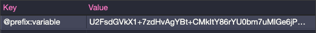

# Encrypt Storage
[](https://github.com/michelonsouza/encrypt-storage/blob/master/package.json) [](https://travis-ci.com/michelonsouza/clean-react) [](https://coveralls.io/github/michelonsouza/encrypt-storage)

The `Encrypt Storage` is a `wrapper` for native `Storage` of browser.

Using the `crypto-js` library as an encryption engine, it saves the encrypted data on the `selected storage` in the same way as the native `Storage`.

> NOTE: Nothing on the front end is entirely secure. The library's proposal is to make it difficult for the user to see the data through the console, but as the secret key is on the front end, if the user searches hard enough, he will end up finding it. Just to make it clear that nothing is completely secure on the front end. Thank you for your attention.

## Table of Contents

- [Encrypt Storage](#encrypt-storage)
  - [Table of Contents](#table-of-contents)
  - [Features](#features)
  - [Installing](#installing)
  - [Examples](#examples)
    - [CommonJS](#commonjs)
    - [JS Import (es6)](#js-import-es6)
    - [Conventions](#conventions)
  - [Parameters](#parameters)
    - [secretKey](#secretkey)
    - [options](#options)
  - [Usage](#usage)
    - [setItem](#setitem)
    - [getItem](#getitem)
    - [removeItem](#removeitem)
    - [clear](#clear)
    - [key](#key)
    - [length](#length)
- [License](#license)

## Features
  - Save encrypted data in `localStorage` and `sessionStorage`
  - Recover encrypted data
  - Use in the same way as native Storage
  - Use with `stateManagement` persisters (`vuex-persist` and `redux-persist`)

## Installing

> To run this project in the development mode, you'll need to have a basic environment with NodeJs and Yarn installed.

Using npm:

```bash
$ npm install encrypt-storage
```

Or yarn:

```bash
$ yarn add encrypt-storage
```

## Examples

### CommonJS

```typescript
const { EncryptStorage } = require('encrypt-storage');

const encryptStorage = EncryptStorage('secret_key', options);

module.exports = encryptStorage
```

### JS Import (es6)

```typescript
import { EncryptStorage } from 'encrypt-storage';

export const encryptStorage = EncryptStorage('secret_key', options);
```
### Conventions

Create a file in your utils folder or a folder of your choice. But I advise you to use it as a singleton, so to speak, for better use.

```
📦 src
 ┣ 📂 utils
 ┃ ┗ 📜 index.ts
 ┗ 📜 index.ts
```

> Directory Layout

```typescript
// const { EncryptStorage } = require('encrypt-storage');

export const encryptStorage = EncryptStorage('secret_key', options)
```

## Parameters

### secretKey

The `secretKey` parameter is a `string` you encrypt your data. If you use a `framework` like `ReactJS` or `VueJS` prefer to store this data in your application's `.env` file:

```typescript
// const { EncryptStorage } = require('encrypt-storage');

export const encryptStorage = EncryptStorage(process.env.SECRET_KEY, options)
```

### options

The options object consists of the following properties:

*prefix*: default `null` - is optional and is the prefix of all keys used in the selected storage as shown below:

```typescript
//...
export const encryptStorage = EncryptStorage('secret_key', {
  ...,
  prefix: '@prefix'
});
```

in your storage:



*stateManagementUse*: default `false` - is a `boolean` value that, when true allows the use of it with `vuex-persist` and `redux-persist`:

**redux-persist**

```typescript
...
const persistConfig = {
  key: 'root',
  storage: encryptStorage,
  whitelist: ['navigation'],
  ...
};
```

**vuex-persist**

```typescript
...
const vuexLocal = new VuexPersistence({
  storage: encryptStorage
})
```

*storageType*: default `localStorage` - is the type of storage that will be used, at the moment only `localStorage` and` sessionStorage` are allowed:

```typescript
//...
export const encryptStorage = EncryptStorage('secret_key', {
  ...,
  storageType: 'sessionStorage'
});
```

## Usage

The usage follows the premise that encryptStorage has been "instantiated" in another file. In the example, the utils folder is used and JS imports.

### setItem
```typescript
...
import { encryptStorage } from './utils';

encryptStorage.setItem('user', { name: 'John', age: 36 });
```
### getItem
the getItem function is slightly different from the native api because it does not need to have its data treated, when the data exists, by JSON.parse as follows:

```typescript
...
encryptStorage.setItem('user', { name: 'John', age: 36 });
const decryptedData = encryptStorage.getItem('user');

// { name: 'John', age: 36 } (is an object Javascript, not a string)
```

### removeItem

Remove an item from `selectedStorage`

```typescript
...
encryptStorage.removeItem('user');
```

### clear

Clear all data from `selectedStorage`

```typescript
...
encryptStorage.clear();
```

### key

Returns a key of `index` param or `null` if not exists

```typescript
...
encryptStorage.key(0);
```

### length

Returns a `quantity` of `keys` existents in `selectedStorage`

```typescript
...
encryptStorage.length;
```

# License

[MIT License](/LICENSE)
