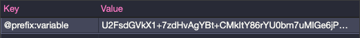

#  Encrypt Storage
  
The `Encrypt Storage` is a `wrapper` for native `Storage` of browser.
  
Using the `crypto-js` library as an encryption engine, it saves the encrypted data on the `selected storage` in the same way as the native `Storage`.
  
  
- [Encrypt Storage](#encrypt-storage )
  - [Features](#features )
  - [Installing](#installing )
  - [Example](#example )
    - [CommonJS](#commonjs )
    - [JS Import (es6)](#js-import-es6 )
  - [Parameters](#parameters )
    - [secretKey](#secretkey )
    - [options](#options )
  - [Usage](#usage )
    - [setItem](#setitem )
    - [getItem](#getitem )
    - [removeItem](#removeitem )
    - [clear](#clear )
    - [key](#key )
    - [length](#length )
  
##  Features
  
  - Save encrypted data in `localStorage` and `sessionStorage`
  - Recover encrypted data
  - Use in the same way as native Storage
  - Use with `stateManagement` persisters (`vuex-persist` and `redux-persist`)
  
  
##  Installing
  
Using npm:
```bash
$ npm install encrypt-storage
```
Using yarn:
```bash
$ yarn add encrypt-storage
```
  
##  Example
  
###  CommonJS
  
```typescript
const { EncryptStorage } = require('encrypt-storage');
  
const encryptStorage = EncryptStorage('secret_key', options);
  
module.exports = encryptStorage
```
  
###  JS Import (es6)
  
```typescript
import { EncryptStorage } from 'encrypt-storage';
  
export const encryptStorage = EncryptStorage('secret_key', options);
```
  
Create a file in your utils folder or a folder of your choice. But I advise you to use it as a singleton, so to speak, for better use.
  
```
📦 src
 ┣ 📂 utils
 ┃ ┗ 📜 index.ts
 ┗ 📜 index.ts
```
  
```typescript
// const { EncryptStorage } = require('encrypt-storage');
  
export const encryptStorage = EncryptStorage('secret_key', options)
```
  
##  Parameters
  
###  secretKey
  
The `secretKey` parameter is a `string` you encrypt your data. If you use a `framework` like `ReactJS` or `VueJS` prefer to store this data in your application's `.env` file.
  
###  options
  
The options object is made up of the following properties:
  
*prefix*: default `null` - is optional and is the prefix of all keys used in the selected storage as shown below:
```typescript
//...
export const encryptStorage = EncryptStorage('secret_key', {
  ...,
  prefix: '@prefix'
});
```
  
in your storage:
  

  
*stateManagementUse*: default `false` - is a `boolean` value that, when true allows the use of it with `vuex-persist` and `redux-persist`:
  
**redux-persist**
```typescript
...
const persistConfig = {
  key: 'root',
  storage: encryptStorage,
  whitelist: ['navigation'],
  ...
};
```
  
**vuex-persist**
```typescript
...
const vuexLocal = new VuexPersistence({
  storage: encryptStorage
})
```
  
*storageType*: default `localStorage` - is the type of storage that will be used, at the moment only `localStorage` and` sessionStorage` are allowed:
  
```typescript
//...
export const encryptStorage = EncryptStorage('secret_key', {
  ...,
  storageType: 'sessionStorage'
});
```
  
##  Usage
  
The usage follows the premise that encryptStorage has been "instantiated" in another file. In the example, the utils folder is used and JS imports.
  
###  setItem
  
```typescript
...
import { encryptStorage } from './utils';
  
encryptStorage.setItem('user', { name: 'John', age: 36 });
```
###  getItem
  
the getItem function is slightly different from the native api because it does not need to have its data treated, when the data exists, by JSON.parse as follows:
  
```typescript
...
encryptStorage.setItem('user', { name: 'John', age: 36 });
const decryptedData = encryptStorage.getItem('user');
  
// { name: 'John', age: 36 } (is an object Javascript, not a string)
```
  
###  removeItem
  
Remove an item from `selectedStorage`
```typescript
...
encryptStorage.removeItem('user');
```
  
###  clear
  
Clear all data from `selectedStorage`
```typescript
...
encryptStorage.clear();
```
  
###  key
  
Returns a key of `index` param or `null` if not exists
```typescript
...
encryptStorage.key(0);
```
  
###  length
  
Returns a `quantity` of `keys` existents in `selectedStorage`
```typescript
...
encryptStorage.key(0);
```
  
Sorry for my english 😢
  